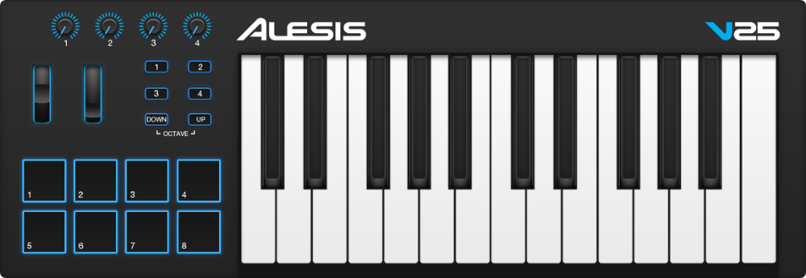

# Alesis V Series

Source: Screenshot of Alesis V25 Editor

## List of controllers
Since the Alesis V25, the Alesis V49 and the Alesis V61 are basically the same controller only differing in the number of keys only one device script is needed.

__Right now the configurations for the V49 and the V61 are untestet. This isn't a problem as they are basically the default configurations with the switches set to momentary mode instead of toggle mode as well as linear velocity curve for the keys and drum pads (Curve 1).__

## Features
The controllers from the Alesis V Series are a MIDI keyboards with
* 25/49/61 velocity sensitive full size keys
* 8 velocity sensitive drum pads
* 4 switches
* 4 rotary potentiometers
* pitch wheel
* mod wheel

## Installation
Install the script (`device_Alesis_V_Series.py`) to the user data folder as described in the main `README.md`. Next send the configuration file (`configuration.vXX`) to the controller using the manufacturers utility ([Alesis V25 Editor](https://alesis.com/products/view2/v25)/[Alesis V49 Editor](https://alesis.com/products/view2/v49)/[Alesis V61 Editor](https://alesis.com/products/view2/v61)).

## Overall settings
The velocity curves are adjusted to make it feel more responsive.

This script provides three modes, which mainly affect the drum pads features. For changing the mode the switches can be used. To make the LEDs work correctly make sure to set the input and the output device called `V25`/`V49`/`V61` to the same dedicated port. Unfortunately, there is no visual feedback on which mode is currently selected.

### Transport Mode (default) - Switch 1
This mode can be activated with switch 1. It maps the drum pads the following way:
* Pad 1: pattern/song mode
* Pad 2: play/pause
* Pad 3: stop
* Pad 4: record
* Pad 5: metronome
* Pad 6: wait for input to start playing
* Pad 7: countdown before recording
* Pad 8: loop recording

### FPC Mode - Switch 2
The FPC Mode remaps the drum pads to play the notes with default FPC settings. It maps the drum pads the following way:
* Pad 1: Crash
* Pad 2: Closed Hat
* Pad 3: Pedal HiHat
* Pad 4: Open HiHat
* Pad 5: Kick Drum
* Pad 6: Snare 1
* Pad 7: Snare 2
* Pad 8: SideStick

### TapTempo Mode - Switch 3
Use any drum pad to tap the tempo. Beware: The change is instantanious!

### Deactivated Mode - Switch 4
The Deactivated Mode deactivates the drum pads to prevent accidentally triggering. The pads can now be used to rest your left hand on it.